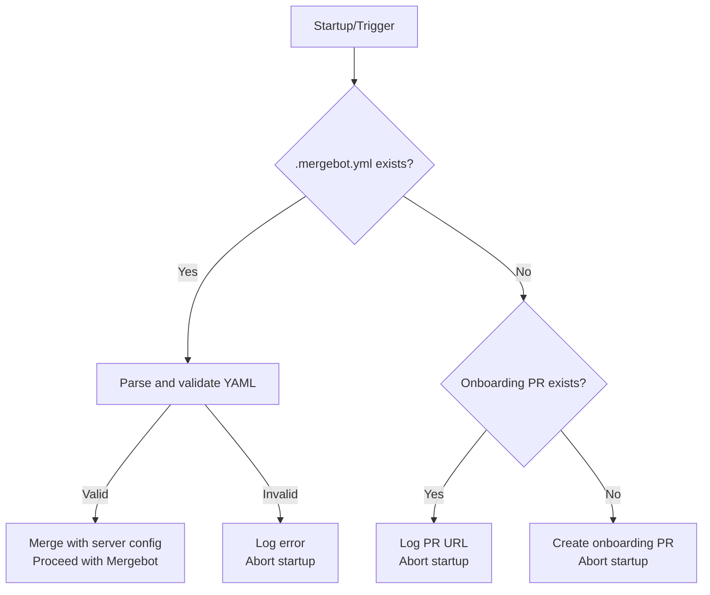

# Mergebot Onboarding Workflow & Configuration

## Overview

Mergebot uses a repository-based configuration file, `.mergebot.yml`, to control its behavior. This onboarding workflow ensures every repository is properly configured before Mergebot runs, providing a transparent, user-friendly, and auditable setup process.

---

## How the Onboarding Workflow Works



### 1. **Startup Check**

When Mergebot starts (in any mode), it performs the following steps:

- **Detects the platform** (GitHub, GitLab, or other VCS).
- **Checks for `.mergebot.yml`** in the default branch of the repository.

### 2. **If `.mergebot.yml` Exists and is Valid**

- The YAML is parsed and merged into the runtime/server config.
- The merged config is validated against the schema.
- If valid, Mergebot proceeds with its normal operation.

### 3. **If `.mergebot.yml` is Missing**

- Mergebot checks for an existing onboarding PR (from the `mergebot/onboarding` branch).
- **If an onboarding PR already exists:**
  - Mergebot logs the PR/MR URL and aborts startup.
  - The user must merge the PR/MR to enable Mergebot.
- **If no onboarding PR exists:**
  - Mergebot creates a new onboarding PR/MR with a default `.mergebot.yml`.
  - The user must review, customize, and merge the PR/MR to enable Mergebot.

### 4. **If `.mergebot.yml` is Present but Invalid**

- If the YAML is malformed or does not conform to the schema:
  - Mergebot logs a clear error and aborts startup.
  - The user must fix the YAML syntax or config errors in the repo.

---

## Configuration Precedence

1. **Server/Default Config** (e.g., `config.yaml`)
2. **Repo Config** (`.mergebot.yml` in the default branch)
   - Repo config takes precedence and can override server defaults.

---

## Onboarding PR Details

- The onboarding PR/MR is created from the `mergebot/onboarding` branch to the default branch.
- Only one onboarding PR/MR is ever open at a time (Mergebot checks for duplicates before creating).
- The PR/MR contains a default `.mergebot.yml` and instructions for customization.
- The onboarding PR/MR now documents the `analysis.max_mrs` option, allowing you to limit the number of PRs/MRs analyzed per run.
- By default, Draft/WIP PRs/MRs are skipped. To analyze them, set `draft_mrs: true` in your config.
- **Note:** Mergebot always requires a server/application configuration file (`mergebot/config.yaml`) to run. This file defines the default/global behavior and is merged with any repository config (`.mergebot.yml`) to create a unified configuration. If `mergebot/config.yaml` is missing, Mergebot will fail to start.
- **VCS API access:**
  - For GitHub: **Recommended: Use a GitHub App for Mergebot service user actions.**
    - Create a GitHub App in your organization or user account.
    - Set the following permissions:
      - Contents: Read & write
      - Pull requests: Read & write
      - Issues: Read & write
      - Checks: Read & write (optional, for CI status)
      - Metadata: Read-only (always granted)
    - Subscribe to webhooks for: `pull_request`, `issue_comment`, and any others Mergebot should react to.
    - Install the App on the target repository or organization.
    - In your Mergebot config, supply:
      ```yaml
      repository:
        type: "github"
        github:
          base_branch: "main"
          app_id: <your-app-id>
          installation_id: <your-installation-id>  # optional; auto-discovered if omitted
          private_key: <your raw private key value>  # or set GITHUB_APP_PRIVATE_KEY env
      ```
    - You can also set these as environment variables: `GITHUB_APP_ID`, `GITHUB_APP_INSTALLATION_ID`, `GITHUB_APP_PRIVATE_KEY`.
    - **Legacy:** You may still use a dedicated GitHub user and personal access token (`GITHUB_TOKEN`), but this is discouraged. If both are present, Mergebot will use the App credentials.
    - _Do not use a personal user’s API token_, as this will make it appear that user is performing all Mergebot actions.
  - For GitLab: Create a dedicated GitLab user or Project Bot, and generate a personal access token (`GITLAB_PERSONAL_ACCESS_TOKEN`).
  - Add this service account as a member to the relevant project(s) or organization(s) with the minimum required permissions.
  - _Do not use a personal user’s API token_, as this will make it appear that user is performing all Mergebot actions.
- Once merged, Mergebot will use the repo config for all future operations.
- The onboarding PR/MR now documents the `analysis.max_mrs` option, allowing you to limit the number of PRs/MRs analyzed per run.
- By default, Draft/WIP PRs/MRs are skipped. To analyze them, set `draft_mrs: true` in your config.
- **Note:** Mergebot always requires a server/application configuration file (`mergebot/config.yaml`) to run. This file defines the default/global behavior and is merged with any repository config (`.mergebot.yml`) to create a unified configuration. If `mergebot/config.yaml` is missing, Mergebot will fail to start.

---

## Error Handling

- **Missing config:** Onboarding PR is created (or referenced if already open).
- **Invalid YAML:** Startup aborts with a clear error; user must fix the file.
- **Unsupported platform:** Startup aborts with an error.

---

## Platform Agnostic Design

- The onboarding workflow is designed to support multiple platforms.
- Mergebot fully supports both GitHub and GitLab onboarding workflows.

---

## Example: Default `.mergebot.yml`

```yaml
# Default Mergebot configuration
# See https://github.com/your-org/mergebot for documentation
# You can now control how many pull or merge requests (PRs/MRs) Mergebot will analyze at a time.
# Add the following to your config to set a limit (optional):
#
# analysis:
#   max_mrs: 10  # Maximum number of PRs/MRs to analyze at once (0 or missing = unlimited)
#   draft_mrs: false  # If true, analyze Draft/WIP PRs/MRs. If false (default), skip Draft/WIP PRs/MRs.
repository:
  type: "gitlab"
  gitlab:
    base_branch: "main"
# For GitHub, use:
# repository:
#   type: "github"
#   github:
#     base_branch: "main"
#     # GitHub App authentication (recommended)
#     app_id: <your-app-id>
#     installation_id: <your-installation-id>  # optional; auto-discovered if omitted
#     private_key: <your raw private key value>  # or set GITHUB_APP_PRIVATE_KEY env

approval_policy:
  threshold: 3.0
  weights:
    CodeAnalysis: 0.4
    ComplexityAnalysis: 0.2
    TestAnalysis: 0.2
    RiskAnalysis: 0.2
```

---

## Summary

- Mergebot will not run unless a valid `.mergebot.yml` is present in the repo.
- The onboarding PR/MR workflow ensures every repo is properly configured, with no duplicates.
- All config is validated and merged in a robust, platform-agnostic way.

For more details, see the main [Home](../index.md) or [Approval Policy](../configuration/approval_policy.md).

---

## CI Integration

You can run Mergebot as part of your CI pipelines to automate code review and impact assessment.

- **GitHub Actions:**
  See [GitHub Actions Operations Guide](../operations/github_actions.md)
- **GitLab CI:**
  See [GitLab CI Operations Guide](../operations/gitlab_ci.md)
- **Direct invocation / custom CI:**
  Mergebot can be invoked using Docker or Python in any pipeline system.

Set up your credentials as described above, then connect to your platform’s CI as detailed in the operations docs for automation best practices.
